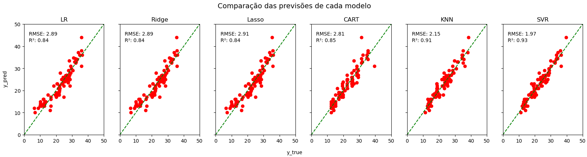

[](https://www.linkedin.com/in/pedro-bull-0363ba1a1/)
[](https://www.python.org/)

# Previsão de consumo de combustível em automóveis

Este projeto foi desenvolvido como trabalho final do módulo de Machine Learning da Pós-graduação em Data Science e Advanced Analytics da PUC-RJ.


[Link original para o dataset](https://www.kaggle.com/datasets/uciml/autompg-dataset)

<p align="center"> 
  <a href="https://www.linkedin.com/in/pedro-bull-0363ba1a1/" target="_blank"></a> 
</p>

## Objetivos

A base de dados Auto-MPG contém informações sobre veículos fabricados entre 1970 e 1982 nas regiões do USA, JPN e EUR. O objetivo deste projeto é construir um modelo de regressão para prever a eficiência de combustível de um veículo, medida em milhas por galão (MPG - miles per gallon), com base em características mecânicas e de fabricação.

Em um cenário real, a análise poderia ser utilizada por uma empresa do ramo logístico para a seleção de veículos para sua frota, por exemplo. Com uma base de dados semelhante contendo características técnicas dos veículos disponíveis do mercado, o modelo seria capaz de auxiliar no planejamento de custos com combustível e, finalmente, na definição de relações custo-benefício para os veículos selecionados pela empresa.

## Estrutura do repositório

O repositório está estruturado da seguinte forma:

```
├── data
├── images
├── notebooks
├── reports
```

- Na pasta `data` estão os dados utilizados no projeto. A base de dados original é o arquivo `auto-mpg.csv`, sendo que os demais datasets foram gerados durante o projeto e salvos na pasta para fins de organização e versionamento.
- Na pasta `images` estão as imagens utilizadas neste README.
- Na pasta `notebooks` estão os notebooks com o desenvolvimento do projeto. Em detalhes, temos:
  - [`fuel_saving_anl`](notebooks/fuel_saving_anl.ipynb): notebook com todo o desenvolvimento do projeto.
- Na pasta `reports` estão os relatórios gerados durante o projeto utilizando a biblioteca [ydata-profiling](https://github.com/ydataai/ydata-profiling).

## Detalhes do dataset utilizado

A base de dados [`Mall_Customers.csv`](dados/Mall_Customers.csv) contém os seguintes dados:

1. `Milhas por galão (mpg)`: Variável target que indica a eficiência do veículo.
2. `Cilindros (cylinders)`: Indica o número de cilindros no motor do veículo, sendo esse um parâmetro da dinâmica de motores que influencia diretamente no consumo de combustível
3. `Deslocamento (displacement)`: Refere-se ao volume total deslocado pelos pistões dentro dos cilindros do motor, medido em centímetros cúbicos.
4. `Potência (horsepower)`: Potência do motor medida em HPs.
5. `Peso (weight)`: O peso total do veículo.
6. `Aceleração (acceleration)`: Mede o tempo necessário para o veículo acelerar de 0 a 60 milhas por hora.
7. `Ano do Modelo (model year)`: O ano de fabricação do veículo.
8. `Origem (origin)`: Representa o país de origem do veículo. O dataset contém os valores 1 (EUA), 2 (Europa) e 3 (Japão).
9. `Nome do Carro (car name)`: O nome ou modelo do carro.

# Análise Exploratória dos Dados

Podemos extrair os seguintes insights da descrição estatística dos dados abaixo:


- Nenhuma das colunas, a princípio, parece ter outliers reais(valores que de fato fogem muito do padrão).

- Possívelmente existem outliers matemáticos em função da natureza do cálculo, do tamanho reduzido da base e da distribuição dos dados mas, a princípio, são dados compatíveis com a realidade do problema.

- Existe uma diferença de escala considerável entre alguns dos atributos. Com isso, será necessário fazer um ajuste de escala para evitar interferências no modelo como, por exemplo, para evitar que o mesmo aplique um peso maior para variáveis que possuem uma maior valor absoluto por natureza.


Em seguida, a correlação das variáveis foi avaliada com um gráfico heatmap, que é mostrado abaixo:


Como já esperado, os parâmetros mecânicos do motor relacionados com a potência do mesmo (potência, número de cilíndros e seus deslocamentos) e também o peso do veículo tem uma forte correlação negativa com a eficiência geral do veículo.

Além disso, o ano de fabricação e a região de origem também apresentam certa correlação, o que pode indicar:

- A evolução tecnológica ao longo dos anos fez com que os veículos ficassem mais eficientes, o que de fato é verdadeiro;

- A indústria de cada região tem suas características e, como exemplo, a indústria autoamotiva dos EUA é focada em carros mais pontentes, sem tanta preocupação com a eficiência.

Para avaliar esta última hipótese, foi gerado um gráfico pairplot para apresentar a correlação dos dados com a coluna 'origin' de maneira mais visual. Para facilitar a compreensão, transformei os valores numéricos em siglas para representar cada uma das regiões, as quais servirão também para a etapa de feature engineering.


Assim como os parâmetros do motor e o peso do veículo, os gráficos da diagonal principal mostram que os parâmetros do veículo, de maneira geral, são influenciados diretamente por sua região de origem, especialmente o gráfico que correlaciona a coluna 'mpg' com a coluna 'origin'. Com isso, pode-se afirmar que cada uma das regiões tem seu viés na fabricação dos veículos.

No que diz respeito aos outliers, optei por gerar uma visualização gráfica da distibuição dos dados para avaliar se de fato existem outliers matemáticos na base e se faz senti mantê-los.


De fato, existem dados que extrapolam os limites inferior e/ou superior dos gráficos para alguns dos atributos. Todavia, esses são valores factíveis para o problema e representam apenas veículos que fogem um pouco da média das amostras presentes na base de dados. Com uma base de dados relativamente pequena como essa, facilmente veículos um pouco mais potentes, por exemplo, ou um pouco mais eficientes do que a média já podem ser considerados matematicamente como outliers. Com isso, nenhum outlier será retirado do modelo.

# Modelo Proposto e resultados

A partir de todas as análises realizadas até aqui, foram definidos os seguintes modelos para o problema:

-  Linear Regression
-  Regressão L1(Regularização Lasso)
-  Regressão L2(Regularização Ridge)
-  Decision Tree
-  KNN
-  SVR

Como métricas para avaliação de performance, foram escolhidas:

- R²: Para avaliar o quanto cada modelo se ajusta aos dados disponíveis. Essa métrica foi escolhida com o objetivo de dar suporte às análises.

- RMSE: Para avaliar, em escala, qual a magnitude média do erro de previsão de cada modelo. Essa é a métrica principal para seleção do modelo justamente pelo fato de fornecer uma referência média de quanto o modelo está errando em relação ao valor real.

Os resultados obtidos para os primeiros testes estão detalhados no gráfico abaixo:


A princípio, boa parte dos modelos performou relativamente bem nos dados de treino, com exceção da Regressão L1.

Em seguida, foi realizada uma etapa de otimização de hiperparÂmetros com o GridSearch para extrair o melhor de cada um dos modelos propostos. O resultado final segue detalhado abaixo:



Resultados alcançados:

1. É perceptível que a dispersão dos pontos do modelo SVR, em relação à reta de referência, é considerávelmente menor do que os demais modelos.

2. Com o maior volume de dados disponíveis e, também, com a otimização dos hiperparâmetros, a regressão L1 se aproximou bastante da regressão L2, tendo o RMSE reduzido em mais de 50%, chegando a menos de 3 mpg na fase final de testes.

3. Antes da etapa de otimização, o algotimo KNN era o que estava performando melhor, com um RMSE de 2.30 mpg. Após a otimização, o algoritmo SVR melhorou sua performance consideravelmente, apesar de demorar o dobro do tempo de treinamento, em média, em relação ao KNN para processar os dados, como mostra a tabela com os resultados da validação cruzada. Ainda assim, todos os modelos processaram os dados com bastante celeridade.

# Conclusão

Ao final, o projeto alcançou resultados satisfatórios em relação aos tempos de processamento dos dados e, principalmente, para os resultados alcançados.

O modelo final escolhido para a resolução do problema foi o modelo SVR, o qual teve uma performance cerca de 8% melhor do que o segundo melhor modelo testado. O modelo SVR foi tanto o que se ajustou melhor aos dados de maneira geral, com um R² de 0.93, quanto o que teve o menor valor de erro, com um RMSE de 1.97 mpg.
